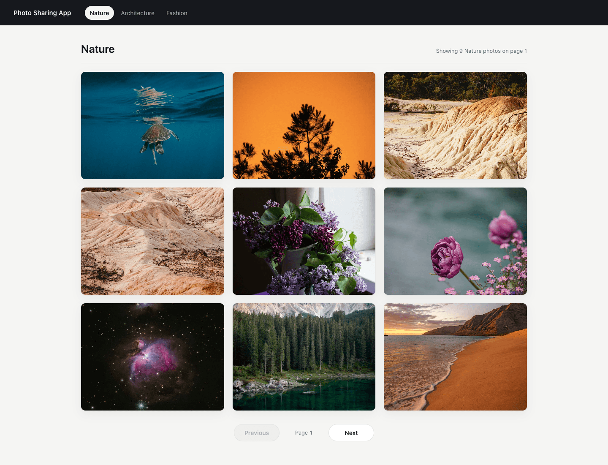
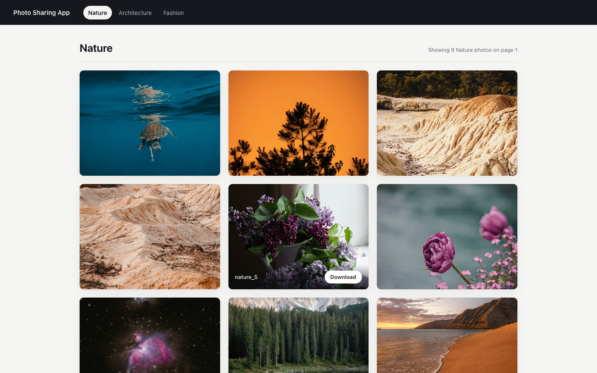
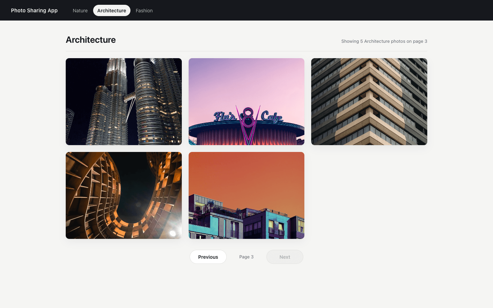
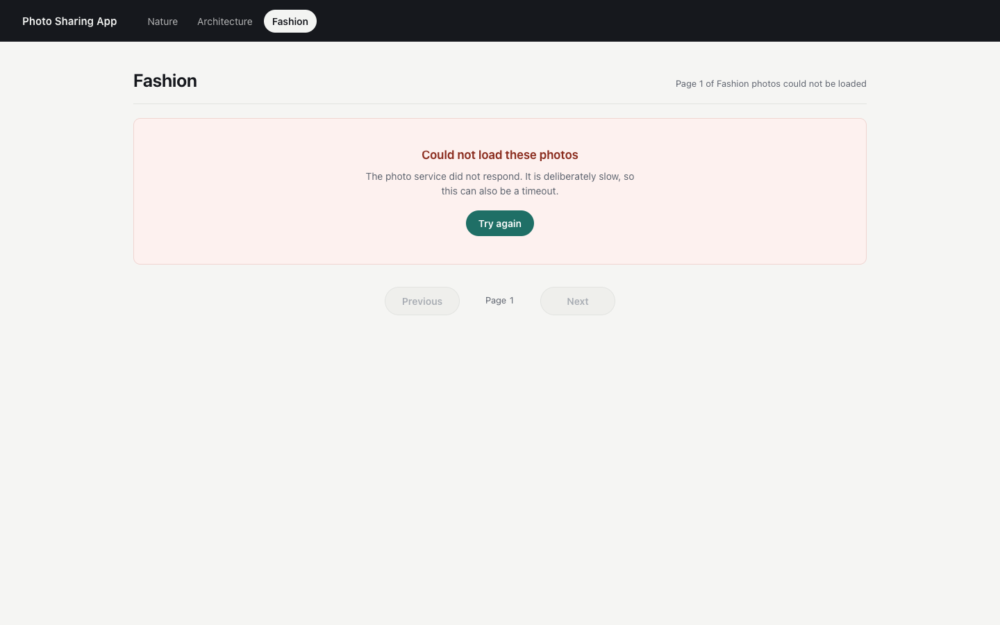
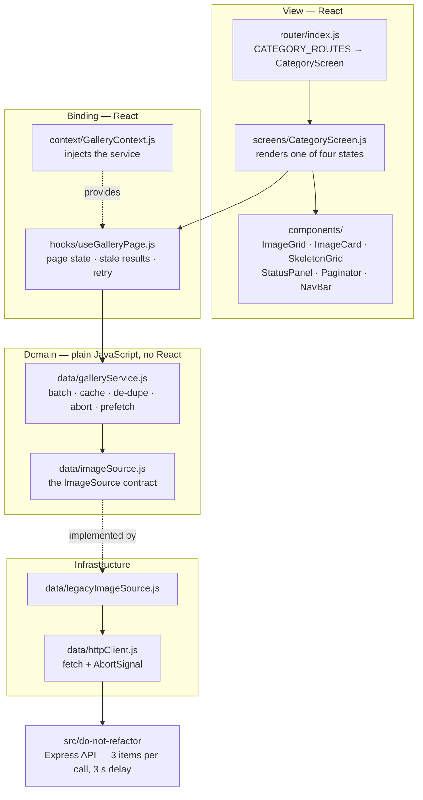
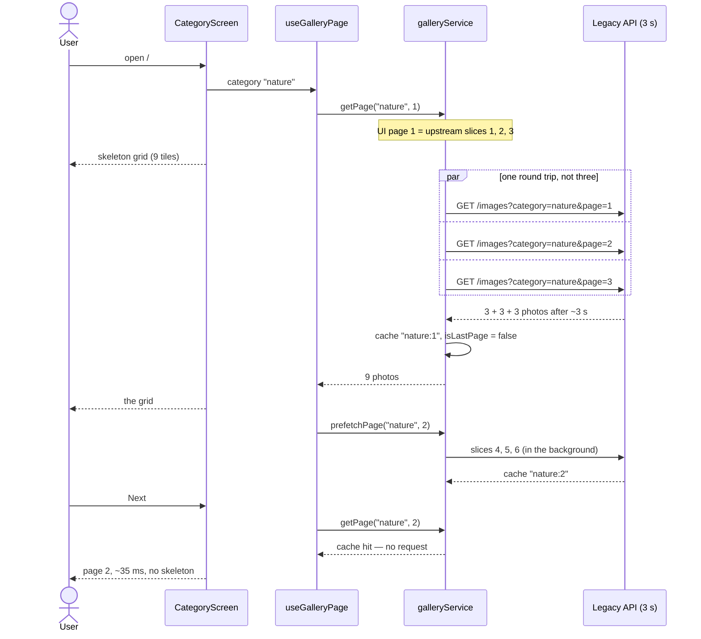

# Photo Sharing App — Valhalla technical test

A React single-page app that browses photos in three categories — nature,
architecture and fashion — nine per page in a 3 x 3 grid, with next/previous
navigation and a download button on every photo.

The photos come from a deliberately crippled "legacy" API that ships with the
repository: it returns **only 3 items per request** and sleeps for **3 seconds**
before responding, and the brief forbids changing it. Reconciling that with a
9-per-page UI — batching, caching, prefetching, cancelling — is the substance
of the exercise, and it is what most of this README is about.

## Screenshots

| A full page of photos                                           | The download affordance                                                                           |
| --------------------------------------------------------------- | ------------------------------------------------------------------------------------------------- |
|  |  |

| The last page of a category                                                                   | The photo service is down                                                      |
| --------------------------------------------------------------------------------------------- | ------------------------------------------------------------------------------ |
|  |  |

The third shot is the interesting one: `architecture` holds 23 photos, so its
last page is partially filled. Detecting that correctly — rather than waiting
for a completely empty response — is what keeps `Next` from leading into a
blank grid.

## Architecture

The app is layered, and the dependencies point inwards: components know about
a hook, the hook knows about a gallery service, the gallery service knows only
an `ImageSource` contract, and just one file decides which implementation of
that contract is used.



The pattern is a **repository with a swappable data source**: `galleryService`
is the repository, `ImageSource` is the port, `legacyImageSource` is the
adapter, and `GalleryContext` is the injection point.

## How a page is assembled

One UI page of 9 needs three upstream responses of 3. They are fetched
together, the result is cached, and the next page is fetched while the user is
still looking at the current one.



## Quickstart

### Docker

```
docker compose up --build
```

Then open <http://localhost:8390>. Two containers come up: the legacy API on
`:8391` and nginx serving the compiled bundle on `:8390`. The photos are
committed to the repository, so there is nothing to seed.

Tear down with `docker compose down -v`.

> The API port is pinned to 8391 on both the host and the container side on
> purpose: the legacy image store builds absolute photo URLs out of its own
> port number, so the browser has to reach it on exactly that port.

### Without Docker

```
npm install
npm start
```

`npm start` runs both processes under `concurrently`: the legacy API on
`:8888` and the webpack dev server on `:3000`. Open <http://localhost:3000>.

## Configuration

| Variable       | Required | Default                 | What it does                                                                                                                                          |
| -------------- | -------- | ----------------------- | ----------------------------------------------------------------------------------------------------------------------------------------------------- |
| `API_PORT`     | no       | `8888`                  | Port the legacy API listens on. It is also embedded in every photo URL the API returns, so the browser must be able to reach the API on this port.    |
| `API_BASE_URL` | no       | `http://localhost:8888` | Base URL the SPA calls. Inlined into the bundle at **build** time by webpack's `DefinePlugin`, so it must be set for `npm run build`, not at runtime. |
| `PORT`         | no       | `3000`                  | Port for `webpack serve` (development only).                                                                                                          |
| `HOST`         | no       | `localhost`             | Host for `webpack serve` (development only).                                                                                                          |

Running the two parts on other ports, for example:

```
API_PORT=8391 npm run start:api
API_BASE_URL=http://localhost:8391 PORT=8390 npm run start:web
```

## Development

```
npm run start:api        # the legacy Express API
npm run start:web        # webpack dev server with hot reload
npm run build            # production bundle into dist/
npm test                 # jest, 74 tests
npm run test:coverage    # the same with a coverage report
npm run lint             # eslint (react, react-hooks, jsx-a11y)
npm run format           # prettier
```

`src/do-not-refactor/` is excluded from Prettier and exempted from the style
rules in `.eslintrc.json`, because the brief puts it off limits. It is still
covered by tests — `__tests__/imageDb.test.js` pins the pagination behaviour
the frontend has to live with, so a change to the contract would be caught.

## Project structure

```
src/
├── do-not-refactor/           the crippled API — off limits per the brief
│   ├── server.js              GET /images, 3 items, 3 s delay
│   ├── image-db.js            66 photos across three categories
│   └── public/images/         the photos themselves
└── refactor-this/
    ├── app.js                 composition root: picks the ImageSource
    ├── data/
    │   ├── imageSource.js     the seam: the ImageSource contract
    │   ├── legacyImageSource.js  adapter for the legacy API
    │   ├── galleryService.js  batching, caching, de-duping, aborting
    │   └── httpClient.js      fetch + AbortSignal, under 50 lines
    ├── hooks/useGalleryPage.js   the only place React meets the data layer
    ├── context/GalleryContext.js dependency injection for the service
    ├── screens/CategoryScreen.js loading / error / empty / ready
    ├── components/            presentational only
    ├── constants/             categories, page sizes, base URL
    ├── router/                three routes, one screen
    ├── css/styles.css         self-contained, no CSS framework
    └── __tests__/             74 tests, incl. an in-memory ImageSource
docker/nginx.conf              static hosting + SPA fallback
docs/screenshots/              the images above
```

## Design notes

### The 3-per-call problem

The API caps every response at 3 items and sleeps 3 seconds first, while the
UI shows 9. Four things follow from that, and they all live in
`data/galleryService.js`:

1. **Batch in parallel.** A page is three slices fetched with `Promise.all`,
   so three 3-second requests overlap into one ~3-second wait instead of
   stacking to 9 seconds.
2. **Cache assembled pages.** Paging back used to cost another 3 seconds for
   data the app had already had.
3. **De-duplicate in-flight pages.** A prefetch the user then navigates to is
   shared, not fetched twice.
4. **Prefetch the next page.** The 3 seconds a user spends looking at a page
   is free time; spending it on the next page makes `Next` effectively
   instant.

Measured with Playwright against the real API, median of three runs each
(script: `docs/measure.js`; timings are wall-clock from click to a full grid
of nine photos):

| Action                                     |  Before |     After |
| ------------------------------------------ | ------: | --------: |
| Cold load, page 1                          | 3268 ms |   3147 ms |
| `Next` clicked the instant page 1 appears  | 3056 ms |   3003 ms |
| `Next` after looking at the page for 3.5 s | 3043 ms | **39 ms** |
| `Previous`, back to page 1                 | 3045 ms | **33 ms** |
| `Next` again, to a page already visited    | 3050 ms | **33 ms** |
| Switching category (cold)                  | 3049 ms |   3050 ms |

The honest reading: the first view of any page still costs one 3-second round
trip, because no amount of client work can make a 3-second server faster. What
changed is everything after that. Note the second row — clicking `Next` the
instant the page renders still waits, because the prefetch has only just
started; it is de-duplicated with the click, so it is never _slower_.

### Cancellation

Every in-flight page owns an `AbortController`. Navigating to another category
aborts the requests for the one being left instead of merely ignoring their
results, so clicking through the nav bar does not leave a queue of useless
3-second requests running against a slow service. Requests for pages of the
_current_ category are deliberately left alone: they will finish into the
cache and be useful.

### Bundle size

|                                 |       Bytes |    Gzipped |
| ------------------------------- | ----------: | ---------: |
| Before, as committed            |     171 706 |     54 668 |
| Before, made to run (see below) |     178 218 |     56 743 |
| After                           | **159 738** | **51 740** |

Two dependencies were dropped and one CDN link with them:

- **axios (~49 KB of source)** → `fetch`. The app makes exactly one kind of
  call, and `fetch` brings native `AbortSignal`, which the cancellation above
  depends on.
- **react-loader-spinner (~45 KB of source)** → a CSS skeleton grid, which is
  also the better loading state: it occupies the space the photos will, so the
  layout does not jump.
- **Bootstrap 4 from a CDN** → ~350 lines of local CSS. It was a
  render-blocking request to a third party for a stylesheet of which the app
  used a fraction.

The build also gained content hashes and a vendor chunk, so React and the
router stay cached across deploys. The split costs ~1.2 KB of lost scope
hoisting, which is measured and worth it. Production source maps were measured
at ~10 KB of extra shipped JavaScript — terser emits less compact output when
it has to map it — so they are off for production builds.

### A bug that only a browser could find

The committed bundle threw `regeneratorRuntime is not defined` on every
`ImageCard` and rendered nothing at all. `@babel/preset-env` had no `targets`,
so it transpiled `async`/`await` down to regenerator; `regenerator-runtime`
was loaded in `jest.setup.js`, so the test suite passed while the app was
blank. `.babelrc` now declares browser targets, `async`/`await` survives
untranspiled, and the polyfill is gone from the test setup. The "before"
numbers above were measured against the committed code plus the one-line
import needed to make it render — comparing against a blank page would have
been meaningless.

### Other correctness work

- **The last page.** A page is the last one if it is short _or_ if the
  prefetch has already proved the following page is empty. The second half
  matters when a category divides exactly by 9: the page is full, so the
  short-page check cannot see the end, and `Next` used to lead to a blank
  grid.
- **Validation errors.** `fetchSlice` is an `async` method, so the argument
  checks reject the promise instead of throwing synchronously past the chain
  and stranding the loading state.
- **Download.** Photos are served from a different origin than the app, and
  browsers ignore `download` on a cross-origin link — the original button just
  navigated to the jpeg. `ImageCard` fetches the bytes, wraps them in an
  object URL from our own origin, and falls back to opening the photo in a new
  tab.
- **An error boundary** around the app, so a render-time throw no longer
  leaves a white page.

### Extensibility: one seam

`data/imageSource.js` defines the only extension point: an object with a
`sliceSize` and a `fetchSlice(category, slice, { signal })`. Everything above
it is written against that contract, so replacing the legacy API means writing
one adapter and changing one line of `app.js`.

It is not speculative. The gallery divides a page by whatever `sliceSize` the
source reports, so a source that can serve nine at once simply causes fewer
requests to be fired — there is a test for exactly that. The test suite uses a
second implementation (`__tests__/helpers/imageSources.js`) to drive the whole
UI without mocking a single module, which is the best evidence the seam is
real.

### Accessibility and UI

Skeletons instead of a blank grid; explicit empty and error states with a
working retry; `role="status"` announcements of what is on screen; the
download control is a real `<button>` reachable by keyboard, and the overlay
it lives in opens on `:focus-within` as well as `:hover`; photos carry
intrinsic dimensions so tiles do not reflow; a `prefers-reduced-motion` branch
turns the shimmer off; the grid falls back to two columns and then one.

## Limitations

- **The first view of a page still takes ~3 seconds.** The API cannot be
  changed and there is no way around one round trip.
- **The cache is in memory and unbounded.** It lives for the life of the page
  and holds at most a few dozen small records for this dataset, so no eviction
  policy is implemented; a larger catalogue would need one.
- **The cache has no invalidation.** The photo set is static. A live catalogue
  would need a TTL or a revalidation strategy.
- **Categories are hard-coded** in `constants/general.js`, because the API has
  no endpoint that lists them.
- **`API_BASE_URL` is a build-time value**, not a runtime one, so a single
  image cannot be re-pointed at a different API without rebuilding.
- **No end-to-end test suite is committed.** The timings and screenshots in
  this README were produced with Playwright scripts kept in `docs/`, which are
  run by hand rather than in CI.
- **React 16 and `ReactDOM.render`.** Upgrading to React 18 was out of scope
  for a refactoring brief and would have been a change the client did not ask
  for.
